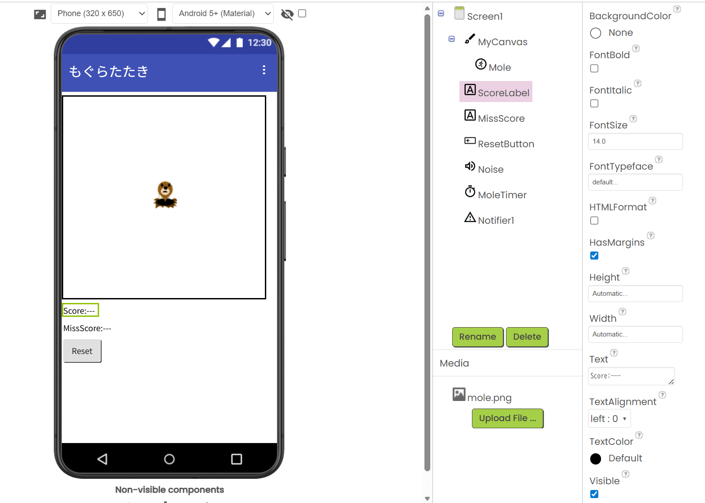
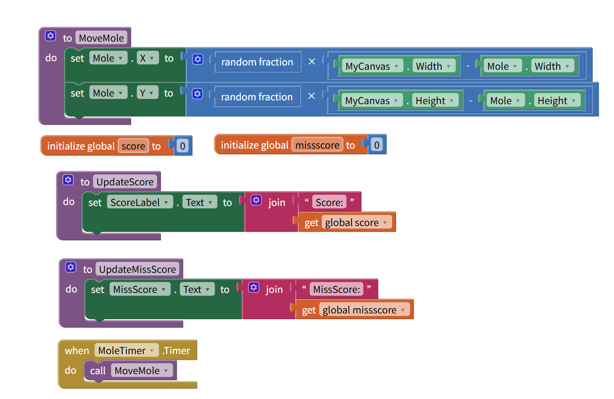
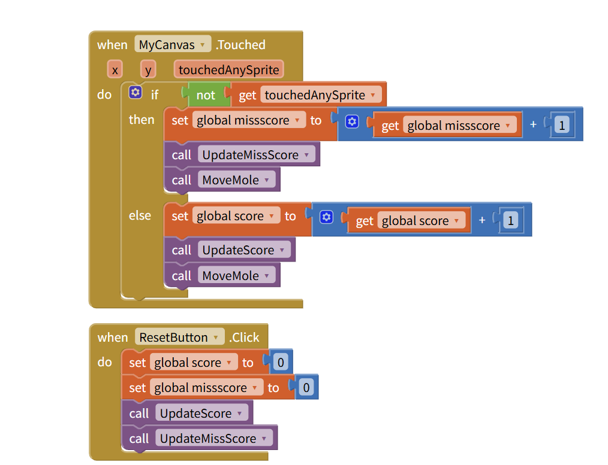

# mol-game

# Mole Whack Game（もぐらたたきゲーム）

## 作品概要
もぐらを叩くゲームアプリです。  
- もぐら（Mole）を叩くとスコアが1点加算  
- もぐら以外を叩くとミススコアが1点加算  
- Canvas上で動くもぐらの動きやスコアを管理
- Resetボタンで、点数を0に戻す

## 制作部分
- スコア計算ロジックの実装  
- Canvas上のタッチ判定  
- もぐらのランダム移動  
- ミス判定（Canvas上の空白タップ時に点数加算）
- 点数の初期化

## 工夫したポイント
- 「not get touchedAnySprite」を使い、もぐら以外のタップを正確に判定  
- スコア表示をリアルタイムで更新  

## 課題と解決策
- 当初、もぐらを叩いてもミススコアが加算されていた  
- 条件分岐を見直し、正確に判定できるよう修正

## スクリーンショット

## ダウンロード
- App Inventor プロジェクトファイル：`mogura_tataki.aia`

## 画像ファイル
- アプリ内画像ファイル：`mole.png`
